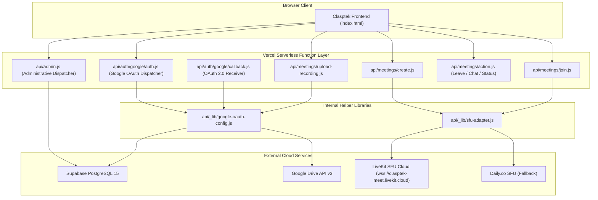
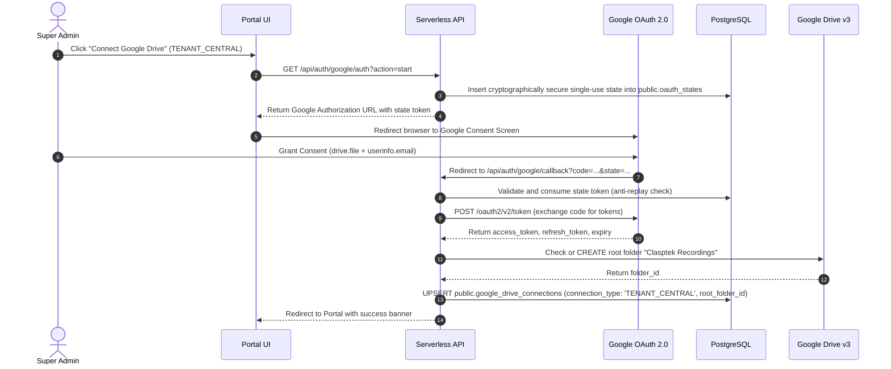
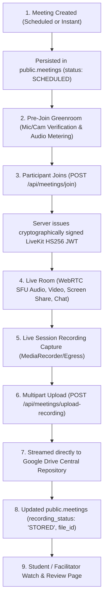

# CLASPTEK PORTAL — PHASE 1 API & INTEGRATION MAP
## Serverless Functions, Google Drive Central Repository & WebRTC Meetings Architecture

---

### Architecture Overview

To comply with the Vercel Hobby tier 12-serverless-function limit, all backend operations are consolidated into **7 primary serverless entry points** supported by internal shared libraries under `api/_lib/`.

---

## 1. Complete Serverless Endpoint Inventory

| Endpoint & Action | HTTP Method | Purpose | Authentication | Authorization | Tenant Validation | Database Tables | External Dependencies | Target Next.js Route |
| :--- | :--- | :--- | :--- | :--- | :--- | :--- | :--- | :--- |
| `POST /api/admin?action=provision-user` | `POST` | Provisions user in GoTrue, creates profile, tenant membership, and personnel link. | Supabase Bearer JWT | `Super Admin`, `Finance Manager` | Authoritative check against `tenant_memberships` | `auth.users`, `profiles`, `tenant_memberships`, `personnel` | GoTrue Admin API | `app/api/admin/provision-user/route.ts` |
| `POST /api/admin?action=delete-personnel` | `POST` | Safely cascades personnel deletion, unlinking dependencies and auth account. | Supabase Bearer JWT | `Super Admin` | Authoritative check against `tenant_memberships` | `personnel`, `tenant_memberships`, `auth.users`, `profiles` | GoTrue Admin API | `app/api/admin/delete-personnel/route.ts` |
| `POST /api/admin?action=google-forms-intake` | `POST` | Webhook ingestion for candidate applications submitted via Google Forms. | Shared Webhook Secret / Public | Webhook Verification | Resolved from payload or default tenant | `crm_intake_applications`, `crm_intake_counters` | Google Forms | `app/api/intake/google-forms/route.ts` |
| `GET/POST /api/auth/google/auth?action=start` | `GET` | Generates CSRF state token and Google OAuth consent URL. | Supabase Bearer JWT | `Super Admin` | Authoritative tenant check | `oauth_states` | Google OAuth 2.0 | `app/api/auth/google/start/route.ts` |
| `GET /api/auth/google/auth?action=status` | `GET` | Returns active connection status and root folder info for Google Drive. | Supabase Bearer JWT | `Super Admin` | Authoritative tenant check | `google_drive_connections` | Google Drive v3 API | `app/api/auth/google/status/route.ts` |
| `POST /api/auth/google/auth?action=disconnect` | `POST` | Revokes OAuth tokens and marks connection inactive. | Supabase Bearer JWT | `Super Admin` | Authoritative tenant check | `google_drive_connections` | Google OAuth Revocation | `app/api/auth/google/disconnect/route.ts` |
| `POST /api/auth/google/auth?action=verify-repository` | `POST` | Verifies root folder accessibility or provisions `Clasptek Recordings`. | Supabase Bearer JWT | `Super Admin` | Authoritative tenant check | `google_drive_connections` | Google Drive v3 API | `app/api/auth/google/verify/route.ts` |
| `GET /api/auth/google/callback` | `GET` | Handles OAuth redirect, verifies state, exchanges code for tokens, provisions root folder. | OAuth `state` + `code` | Single-use state verification | Resolved from `oauth_states` | `oauth_states`, `google_drive_connections` | Google OAuth Token API | `app/api/auth/google/callback/route.ts` |
| `POST /api/meetings/create` | `POST` | Creates meeting record and provisions SFU room. | Supabase Bearer JWT | `Super Admin`, `Facilitator` | Authoritative tenant check | `meetings` | LiveKit / Daily SFU | `app/api/meetings/create/route.ts` |
| `POST /api/meetings/join` | `POST` | Generates participant access token and logs join interval. | Supabase Bearer JWT or Public Token | Host, Facilitator, Student, Guest | Meeting-scoped validation | `meetings`, `meeting_participants` | LiveKit JWT Generator | `app/api/meetings/join/route.ts` |
| `POST /api/meetings/action?action=leave` | `POST` | Records participant leave timestamp and computes session duration. | Participant Session ID | Participant | Meeting-scoped | `meeting_participants`, `meeting_attendance` | None | `app/api/meetings/action/route.ts` |
| `POST /api/meetings/action?action=chat` | `POST` | Persists meeting chat message and broadcasts to room. | Supabase Bearer JWT | Meeting Participant | Meeting-scoped | `meeting_chat_messages` | LiveKit Data Channel | `app/api/meetings/action/route.ts` |
| `POST /api/meetings/upload-recording` | `POST` | Receives multipart binary recording blob, streams to Google Drive, persists metadata. | Supabase Bearer JWT | `Super Admin`, `Facilitator` | Authoritative tenant isolation | `meetings`, `google_drive_connections` | Google Drive v3 Upload API | `app/api/meetings/upload-recording/route.ts` |

---

## 2. Google Drive Central Repository Audit

The integration architecture implements strict organizational isolation between central tenant storage and personal user accounts.

### Architectural Decisions & Invariants

1. **Connection Modes:**
   - `TENANT_CENTRAL`: Authoritative organizational connection. All classroom meeting recordings and student document archives are directed here. Stored with `user_id = NULL` and `connection_type = 'TENANT_CENTRAL'`.
   - `USER_PERSONAL`: Optional individual staff workflow. Stored with specific `user_id`.
2. **Minimal Scopes Principle:**
   - Scopes are strictly limited to:
     - `https://www.googleapis.com/auth/drive.file` (access only to files created or opened by the Clasptek app)
     - `https://www.googleapis.com/auth/userinfo.email`
   - Scopes will **NEVER** be expanded to full Google Drive read/write (`https://www.googleapis.com/auth/drive`).
3. **Automated Token Refresh:**
   - Before executing any Drive API operation, `refreshAccessToken()` verifies token expiry. Expired access tokens are refreshed using the securely stored `refresh_token` without requiring user interaction.
4. **Zero Client Token Exposure:**
   - Google access tokens and refresh tokens are **never** returned to the browser client. All Drive file uploads and permission configurations occur strictly within serverless function runtimes.

---

## 3. WebRTC Meetings & Virtual Classroom Audit

### Meeting Lifecycle Architecture

### SFU Provider Architecture

The platform implements an adapter pattern (`api/_lib/sfu-adapter.js`):
1. **Primary Provider — LiveKitAdapter:**
   - Generates cryptographically signed HS256 JSON Web Tokens directly using native Node.js `crypto.createHmac`.
   - Token grants explicit room permissions: `canPublish`, `canSubscribe`, `canPublishData`, `roomAdmin` (host only).
   - Direct connection to LiveKit Cloud SFU (`wss://clasptek-meet.livekit.cloud`).
2. **Alternative Provider — DailyAdapter:**
   - Integrates with Daily.co cloud via REST API (`https://api.daily.co/v1/rooms`).
   - Issues short-lived meeting tokens.
3. **MockSFUAdapter:**
   - Dedicated exclusively to local headless test harnesses (`test_meetings_production_multiuser.js`).
   - Never presented or enabled in production environments.

### Zero Fake Success Invariant in Recording Uploads

The upload endpoint `api/meetings/upload-recording.js` enforces the **Zero Fake Success** rule:
A recording is **never** marked as `STORED` unless all four conditions are verified:
1. Google Drive upload HTTP response is 200 OK.
2. Google Drive returns a valid, non-empty `id`.
3. File `parents` array contains the authoritative `root_folder_id`.
4. PostgreSQL updates `public.meetings.recording_metadata` successfully.
If any condition fails, the recording status is set to `FAILED` with explicit error logging.
