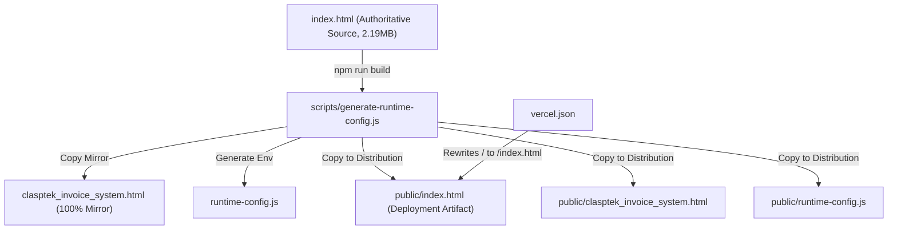
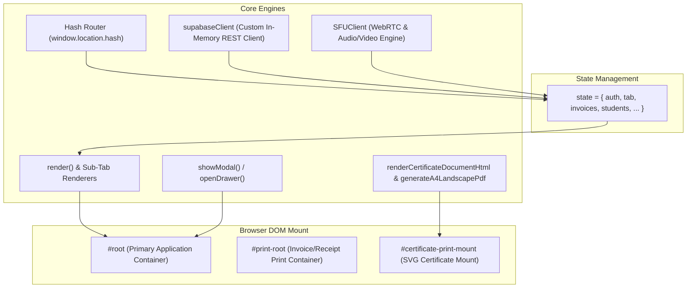

# CLASPTEK PORTAL — PHASE 1 ARCHITECTURE AUDIT
## Comprehensive System Baseline, Entry Points & Frontend Architecture

---

### Executive Summary

| Attribute | Value |
| :--- | :--- |
| **System Name** | Clasptek Enterprise Management Platform / Portal |
| **Audit Phase** | Phase 1 of 10 (Audit Only — Strict Zero Modification Mandate) |
| **Current Architecture** | Monolithic Single-Page Application (HTML5 / Vanilla CSS / Vanilla ES6+ JavaScript) + Serverless Edge APIs (Node.js) + Supabase (PostgreSQL 15, PostgREST, GoTrue Auth, RLS) |
| **Target Architecture** | Next.js 14+ (App Router), React, TypeScript, Supabase SSR, Tailwind/Vanilla CSS Design System Tokens |
| **Authoritative Database** | Supabase Project `logaawoigfxnisimfatf` (`https://logaawoigfxnisimfatf.supabase.co`) |
| **Deployment Target** | Vercel (Hobby Tier configuration, outputDirectory: `public`) |
| **Audit Date** | 2026-09-22 |
| **Audit Status** | **VERIFIED BASELINE ESTABLISHED** |

---

## 1. System Entry Points & File Baseline

An exhaustive forensic file audit was conducted to differentiate authoritative source files from generated artifacts, mirrors, and backups.

### File Classification Inventory

| File Path | Size (Bytes) | Lines | Classification | Verification & Role |
| :--- | :--- | :--- | :--- | :--- |
| `index.html` | 2,188,692 | 44,102 | **CANONICAL SOURCE** | Authoritative application source containing complete HTML structure, CSS design tokens, and monolithic JavaScript application logic. |
| `clasptek_invoice_system.html` | 2,188,692 | 44,102 | **BUILD MIRROR** | Exact byte-for-byte duplicate mirror of `index.html`. Maintained automatically by `scripts/generate-runtime-config.js` to preserve legacy URL references. |
| `public/index.html` | 2,188,692 | 44,102 | **DEPLOYMENT ARTIFACT** | Generated copy placed in Vercel output directory `public/` during `npm run build`. Byte-for-byte identical to root `index.html`. |
| `public/clasptek_invoice_system.html` | 2,188,692 | 44,102 | **DEPLOYMENT ARTIFACT** | Generated copy in `public/` to satisfy direct requests to `/clasptek_invoice_system.html`. |
| `runtime-config.js` | 249 | 4 | **GENERATED CONFIG** | Generated by build script. Injects `window.__CLASPTEK_ENV__` containing public endpoint and publishable key. |
| `public/runtime-config.js` | 249 | 4 | **DEPLOYMENT ARTIFACT** | Production copy of runtime config served to browser client. |
| `index.backup.html` | 962,825 | ~21,400 | **OBSOLETE BACKUP** | Pre-Phase 8 backup snapshot. Retained in repository for historical reference; ignored in `.gitignore`. |
| `clasptek_invoice_system.backup.html` | 962,825 | ~21,400 | **OBSOLETE BACKUP** | Duplicate of `index.backup.html`. |
| `vercel.json` | 2,256 | 66 | **DEPLOYMENT CONFIG** | Vercel configuration specifying build command (`npm run build`), output directory (`public`), security headers, and rewrite rules. |
| `package.json` | 268 | 11 | **PROJECT METADATA** | Defines project name, scripts (`build` and `test`). Contains zero npm dependencies; runtime is dependency-free vanilla JS. |
| `supabase_schema.sql` | 147,035 | 2,987 | **AUTHORITATIVE SCHEMA** | Canonical DDL defining base 61 tables, RLS policies, enums, triggers, and functions. |
| `schema_inventory.json` | 192,088 | 4,215 | **SCHEMA METADATA** | Machine-readable inventory of 61 tables, 129 policies, 27 functions, 66 indexes. |

> [!IMPORTANT]
> **Production Entry Point Decision:**
> For the Next.js migration, `index.html` is the sole authoritative frontend document. Any manual edits applied to `clasptek_invoice_system.html` or `public/*.html` are automatically overwritten during `npm run build`.

---

## 2. Frontend Architecture Audit

The existing client is implemented as a single, self-contained IIFE (`(function() { ... })()`) spanning lines 1,756 through 44,099 of `index.html`.

### 2.1 Global Application State Model

The client state is declared at line 2,801 as a single mutable global object `let state = { ... }`.

Key state branches:
- `state.auth`: Authentication credentials, active GoTrue session, access token, user object, active role, permissions, and tenant ID.
- `state.tab`: Active top-level module (e.g., `'dashboard'`, `'invoices'`, `'studentAccounts'`, `'meetings'`).
- `state.subTab` / `state.meetingSubTab` / `state.invoiceSubTab`: Sub-view routing inside parent modules.
- `state.modal`: Active modal object `{ type, data }` or `null`.
- `state.drawer`: Active slide-out drawer object or `null`.
- `state.students`: Normalized array of authoritative student records (`public.students`).
- `state.enquiries`: Prospect CRM records (`public.enquiries`).
- `state.invoices`: Issued invoices with line items (`public.invoices`).
- `state.payments`: Payment receipts and allocations (`public.payments`).
- `state.expenses`: Operational expenditures and approval statuses (`public.expenses`).
- `state.programmes`: Curriculum programmes and courses (`public.programmes`).
- `state.cohorts`: Student cohorts and schedules (`public.cohorts`).
- `state.enrolments`: Student-to-cohort enrollments (`public.enrolments`).
- `state.trainingSessions`: Classroom training sessions (`public.training_sessions`).
- `state.attendance`: Student attendance records (`public.attendance`).
- `state.facilitatorReports`: Post-session facilitator submissions (`public.facilitator_reports`).
- `state.certificates`: Issued certificates of completion (`public.certificates`).
- `state.meetings`: Scheduled, live, and recorded meetings (`public.meetings`).
- `state.payslips`: Staff and facilitator payroll vouchers (`public.payslips`).
- `state.personnel`: Staff directory records (`public.personnel`).
- `state.budgets`: Budget allocations and expenditure ceilings (`public.budgets`).
- `state.financePeriods`: Fiscal period calendar and lock status (`public.finance_periods`).
- `state.auditLog`: Local and remote audit history (`public.finance_audit_log`).
- `state.supabase`: Connection state machine (`status: 'connected' | 'error' | 'unconfigured'`).

### 2.2 Rendering Lifecycle & DOM Manipulation

1. **Rendering Trigger:** Any mutation to state triggers an explicit call to `render()`.
2. **DOM Reconstruction:**
   - `render()` clears `document.getElementById('root').innerHTML`.
   - Injects top navigation bar (`<header class="cp-topbar">`), collapsible sidebar (`<aside class="cp-sidebar">`), and main content wrapper (`<main class="cp-main">`).
   - Dispatches rendering to the specific tab handler based on `state.tab`:
     - `'dashboard'` $\rightarrow$ `renderDashboardTab(contentView)`
     - `'studentAccounts'` $\rightarrow$ `renderStudentsTab(contentView)`
     - `'invoices'` $\rightarrow$ `renderInvoicesTab(contentView)`
     - `'enquiries'` $\rightarrow$ `renderEnquiriesTab(contentView)`
     - `'certificates'` $\rightarrow$ `renderCertificatesTab(contentView)`
     - `'meetings'` $\rightarrow$ `renderMeetingsTab(contentView)`
     - `'meetingPreJoin'` $\rightarrow$ `renderMeetingPreJoin(contentView)`
     - `'meetingRoom'` $\rightarrow$ `renderMeetingRoom(contentView)`
3. **Event Listener Attachment:** Because `innerHTML` is overwritten on every render, all interactive buttons, inputs, and form controls attach event listeners via `document.getElementById(...).addEventListener(...)` immediately following each template string injection.

### 2.3 Modal & Drawer System

- **Mount Container:** Modals and drawers are injected into a shared overlay element `#modalBackdrop` appended to the DOM.
- **Body Scroll Lock:** Toggling a modal applies class `cp-modal-open` (`overflow: hidden`) to `document.body`.
- **Keyboard Navigation:** Global `keydown` listener on `window` traps `Escape` to execute `closeModal()`.
- **Drawers:** Candidate Intake Drawer (`renderCandidateApplicationDrawer`) operates as a responsive right-aligned slide-out drawer on desktop, transitioning to full-screen sheet on mobile viewports ($\le 640\text{px}$).

### 2.4 Print & Document Generation Subsystem

- **Receipt / Invoice Printing:** Injected into `#print-root`. Applies `@media print` rules hiding `#root` and rendering isolated invoice vouchers.
- **Certificate Printing:** Injected into `#certificate-print-mount`. Applies `@media print` with strict landscape constraints (`@page { size: A4 landscape; margin: 0; }`).
- **Direct PDF Export:** `downloadCertificatePdf(cert)` renders SVG certificate to an off-screen HTML5 Canvas (3,508 $\times$ 2,480 pixels for 300 DPI A4), extracts JPEG blob, and wraps the raw image stream into a standard binary PDF structure via `generateA4LandscapePdf(jpegBytes)`.

---

## 3. Client-Side PostgREST Client Architecture

Rather than depending on the `@supabase/supabase-js` npm bundle, `index.html` implements a custom client object `supabaseClient` (lines 3,015–4,020).

### Methods Implemented

| Method | Signatures | Description |
| :--- | :--- | :--- |
| `getEndpoint()` | `() => string` | Resolves canonical REST endpoint URL (`/rest/v1/`). |
| `getAuthEndpoint()` | `() => string` | Resolves GoTrue endpoint URL (`/auth/v1/`). |
| `getAnonKey()` | `() => string` | Extracts publishable/anon key from meta tag or `window.__CLASPTEK_ENV__`. |
| `isConfigured()` | `() => boolean` | Validates endpoint URL and key existence. |
| `ensureFreshSession()` | `() => Promise<string\|null>` | Restores persisted JWT, detects expiration, executes proactive token refresh via `/auth/v1/token?grant_type=refresh_token`. |
| `from(tableName)` | `(table: string) => QueryBuilder` | Fluid query builder supporting `.select(cols)`, `.eq(col, val)`, `.order(col, opts)`, `.limit(n)`, `.insert(payload)`, `.upsert(payload)`, `.update(payload, match)`, `.delete(match)`. |
| `rpc(fnName, params)` | `(fn: string, params: object) => Promise` | Dispatches POST to `/rest/v1/rpc/{fnName}` with JSON payload. |
| `auth.signInWithPassword()` | `(email, password) => Promise` | POST to `/auth/v1/token?grant_type=password`. |
| `auth.signOut()` | `() => Promise` | Clears tokens, revokes session, clears `localStorage`. |
| `auth.resetPasswordForEmail()` | `(email) => Promise` | POST to `/auth/v1/recover`. |
| `auth.updateUser()` | `(updates) => Promise` | PUT to `/auth/v1/user` with active Bearer token. |
| `ping()` | `() => Promise` | Health check executing lightweight SELECT query against database. |

---

## 4. Error Handling & Circuit Breakers

The client categorizes all PostgREST and network failures using enum `SUPABASE_ERROR_CLASS`:

- `NETWORK_ERROR`: Connection timeout or offline state (triggers 200ms exponential backoff retry).
- `AUTHENTICATION_FAILED`: HTTP 401 (triggers GoTrue session refresh; if refresh fails, forces clean logout).
- `RLS_DENIED`: HTTP 403 (Row-Level Security policy violation; displays permission warning without crashing).
- `TABLE_NOT_FOUND`: HTTP 404 (PostgREST table missing; activates local fallback store).
- `SCHEMA_MISMATCH`: HTTP 409 / 422 (Conflict or constraint failure; displays structured validation error).
- `POSTGRES_ERROR`: HTTP 500 / other database exceptions.
