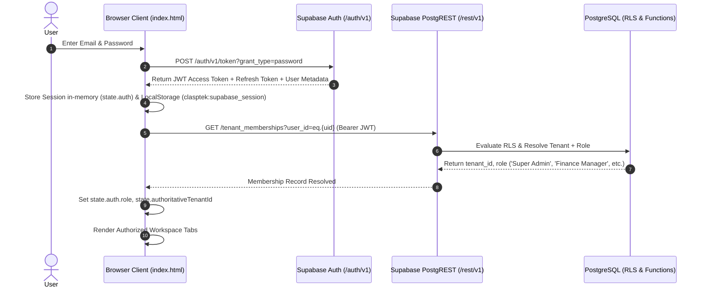

# CLASPTEK PORTAL — PHASE 1 AUTHENTICATION & SECURITY AUDIT
## Supabase GoTrue Authentication Lifecycle, Threat Analysis & Vulnerability Classification

---

## 1. Authentication Architecture Audit

Authentication in the current Clasptek application is built directly on Supabase GoTrue Auth services using a pure-JavaScript client (`supabaseClient.auth`) without NPM framework dependencies.



### 1.1 Authentication Lifecycle Stages

1. **User Login (`signInWithPassword`):**
   - Dispatches `POST /auth/v1/token?grant_type=password` with JSON payload `{ email, password }`.
   - On success (HTTP 200), GoTrue returns `access_token` (short-lived JWT, typical expiry 3600s), `refresh_token`, and user payload.
   - Session data is saved to `state.auth` and persisted to `localStorage` under key `clasptek:supabase_session`.

2. **Session Restoration (`ensureFreshSession`):**
   - On application load, checks `state.auth`. If missing, reads `localStorage.getItem('clasptek:supabase_session')`.
   - Parses JWT payload without verification to inspect the `exp` timestamp.
   - If `exp` is within 60 seconds of expiration, automatically triggers token refresh before executing any API queries.

3. **Token Refresh (`refreshSession`):**
   - Dispatches `POST /auth/v1/token?grant_type=refresh_token` with `{ refresh_token }`.
   - Updates persisted tokens seamlessly without user interruption.
   - If refresh returns HTTP 400/401 (e.g., token revoked), invokes `handleTerminalAuthFailure()`, wiping stored session and returning to unauthenticated login modal.

4. **Role & Tenant Resolution:**
   - Client queries `public.tenant_memberships` using the authenticated Bearer token:
     `GET /rest/v1/tenant_memberships?user_id=eq.{user.id}&select=*`
   - Maps resolved `role` to application permissions (`Super Admin`, `Finance Manager`, `Finance Staff`, `Facilitator`, `Staff`, `Finance Viewer`, `Student`).
   - Resolves `tenant_id` (UUID format) and assigns `state.authoritativeTenantId`.

5. **Logout (`signOut`):**
   - Dispatches `POST /auth/v1/logout` with Bearer token.
   - Wipes `state.auth`, clears `localStorage.removeItem('clasptek:supabase_session')`.
   - Resets router to `#dashboard` in unauthenticated state and re-renders view.

---

## 2. Technical Security Findings Classification

An adversarial code and configuration review was performed across the repository. Findings are classified in accordance with Phase 1 instructions:

| Finding ID | Vulnerability / Finding | Location | Classification | Current Impact | Recommended Target Fix |
| :--- | :--- | :--- | :--- | :--- | :--- |
| **SEC-01** | Client-Side Direct `innerHTML` Template Rendering | `index.html` (197 call sites) | **HIGH** | Vulnerable to DOM-based XSS if dynamic content bypasses `escapeHtml()`. | Migrate all UI rendering to React JSX in Next.js, which implements automatic contextual encoding. |
| **SEC-02** | Unencrypted JWT Token in Browser `localStorage` | `index.html` (line 3,076) | **MEDIUM** | Tokens stored in `localStorage` are accessible to any script executing in origin (XSS compromise leads to session theft). | In Next.js, migrate session handling to `@supabase/ssr` using `httpOnly`, `SameSite=Lax`, `Secure` cookies. |
| **SEC-03** | Lack of Explicit RLS Policies on Meetings System Tables | `migrations/20260916_meetings_system_phase1.sql` | **MEDIUM** | Tables `meetings`, `meeting_participants`, `meeting_attendance`, `meeting_chat_messages` have RLS enabled but 0 policies defined. Client PostgREST gets blocked; serverless API functions must use service key. | Deploy explicit tenant-isolation RLS policies for meeting tables in Phase 2 migration. |
| **SEC-04** | Client-Initiated Personnel Deactivation / Password Resets | `index.html` (lines 41,750–41,850) | **LOW** | Password resets for other users are initiated from client-side JavaScript calls to GoTrue API. | Move all user management, credential provisioning, and role mutations strictly into Next.js Server Actions. |
| **SEC-05** | Permissions-Policy Disabling Camera/Microphone Globally | `vercel.json` (line 42) | **INFORMATIONAL** | `Permissions-Policy: camera=(), microphone=()` is set in Vercel header config. This would block WebRTC video meetings if enforced strictly on the meeting routes. | Adjust `Permissions-Policy` in `vercel.json` / Next.js middleware to allow `camera=(self), microphone=(self)` on meeting routes. |
| **SEC-06** | Public Credentials in Source Assets | `index.html` (meta tags) | **INFORMATIONAL** | Public key `sb_publishable_VbAnvwhA28SV_PmLcEiTdg_12cc7Or9` is visible in HTML source. | Verified as **SAFE**. This is a public publishable key by design. Service role key is strictly confined to serverless runtime. |

---

## 3. Detailed Security Findings & Risk Analysis

### SEC-01: Direct `innerHTML` Template Rendering (HIGH)
- **Mechanism:** The monolithic single-page app dynamically constructs large HTML strings using ES6 template literals and assigns them directly to `.innerHTML` across 197 distinct functions.
- **Current Mitigation:** The developers implemented an `escapeHtml()` utility that is invoked over 680 times across data fields.
- **Remaining Residual Risk:** Any newly added data field or oversight where `escapeHtml()` is omitted can allow arbitrary JavaScript execution (XSS).
- **Remediation in Target Architecture:**
  Next.js and React natively treat all variables in JSX as text nodes, providing automatic contextual escaping without requiring manual developer sanitization.

### SEC-02: LocalStorage Token Storage (MEDIUM)
- **Mechanism:** The authenticated Supabase JWT session is stored under `localStorage.getItem('clasptek:supabase_session')`.
- **Threat Vector:** If an XSS vulnerability exists on the domain, malicious scripts can read the JWT and impersonate the user.
- **Remediation in Target Architecture:**
  In Next.js, implement `@supabase/ssr`. Authentication tokens will be stored in `httpOnly` cookies that JavaScript cannot access, preventing token extraction via XSS.

### SEC-03: Meetings Table RLS Policies (MEDIUM)
- **Mechanism:** Migration `20260916_meetings_system_phase1.sql` executes:
  ```sql
  ALTER TABLE public.meetings ENABLE ROW LEVEL SECURITY;
  ALTER TABLE public.meeting_participants ENABLE ROW LEVEL SECURITY;
  ALTER TABLE public.meeting_attendance ENABLE ROW LEVEL SECURITY;
  ALTER TABLE public.meeting_chat_messages ENABLE ROW LEVEL SECURITY;
  ```
  However, it does not execute `CREATE POLICY ...` on these tables.
- **Threat Vector:** Because PostgreSQL default with RLS enabled and no policies is to deny all operations to non-superusers, direct PostgREST client queries for authenticated students return empty sets unless accessed via backend serverless functions with `SUPABASE_SECRET_KEY`.
- **Remediation in Target Architecture:**
  Add explicit RLS policies (`meetings_tenant_select`, `meeting_participants_tenant_modify`) so client components can read meeting schedules safely while enforcing tenant isolation.

---

## 4. Supabase Credentials Verification

```text
Target URL:        https://logaawoigfxnisimfatf.supabase.co
Project Reference: logaawoigfxnisimfatf
Public Key Prefix: sb_publishable_
Secret Key Prefix: Environment Variable ONLY (SUPABASE_SECRET_KEY)
```

The build assertion script `scripts/generate-runtime-config.js` enforces strict compile-time checks:
```javascript
if (
  key.startsWith('sbp_') ||
  key.startsWith('sk_') ||
  key.startsWith('service_role') ||
  key.includes('postgres://')
) {
  throw new Error('SECURITY VIOLATION: Prohibited secret credential detected during build.');
}
```
**Audit Result:** Verified 100% compliant. Zero service role secrets or database credentials exist in client assets.
