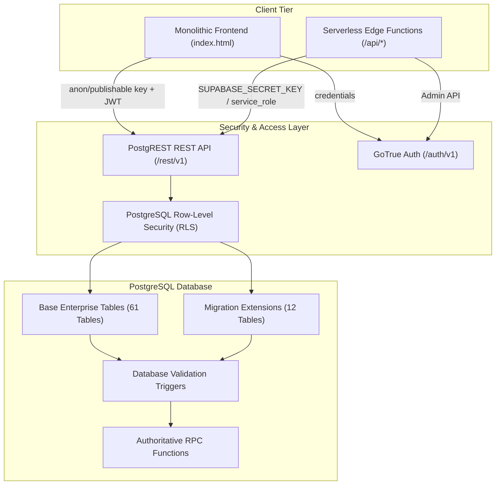
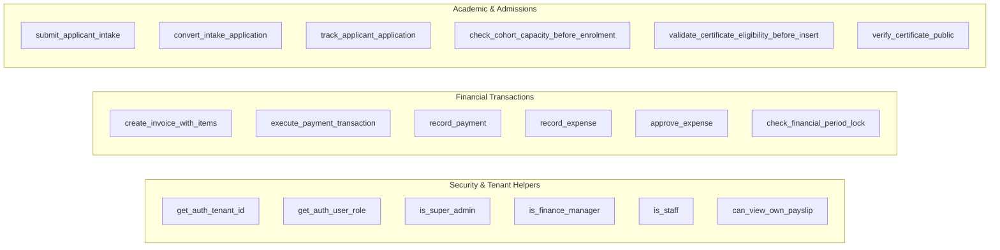

# CLASPTEK PORTAL — PHASE 1 DATABASE MAP
## Frontend / API / Database / RLS Dependency Mapping & Data Security Architecture

---

### Database Infrastructure Architecture

The database layer is hosted on PostgreSQL 15 via Supabase project `logaawoigfxnisimfatf`.
The schema architecture comprises **73 tables**, **153 RLS policies**, **33 stored functions / RPCs**, and **70+ indexes**.

---

## 1. Authoritative Tables Dependency Map

| Table Name | Purpose | Frontend Modules | Write Operations | Read Operations | RLS Enabled | Tenant Sensitive |
| :--- | :--- | :--- | :--- | :--- | :--- | :--- |
| `tenants` | Multi-tenant organization boundaries | Settings, Admin | Server/Seed only | Read by Admin | YES | **AUTHORITATIVE ROOT** |
| `profiles` | User profiles linked to `auth.users` | Auth, Topbar, Personnel | UPDATE (self profile) | SELECT (own or tenant) | YES | YES (`tenant_id`) |
| `tenant_memberships` | Role mapping per user and tenant | Auth, Personnel, Admin | Edge API (`provision-user`) | SELECT (self or admin) | YES | **CRITICAL BOUNDARY** |
| `students` | Authoritative student registry | Students, Admissions, Finance | INSERT / UPDATE | SELECT | YES | YES (`tenant_id`) |
| `enrolments` | Student-cohort enrollments | Enrolments, Cohorts, Training | INSERT / UPDATE | SELECT | YES | YES (`tenant_id`) |
| `programmes` | Academic programmes & tuition fees | Programmes, Invoices | INSERT / UPDATE (Admin) | SELECT (All) | YES | YES (`tenant_id`) |
| `courses` | Modular curriculum subjects | Programmes, Curriculum | INSERT / UPDATE (Admin) | SELECT (All) | YES | YES (`tenant_id`) |
| `programme_courses` | Programme-to-course junction | Programmes, Curriculum | INSERT / UPDATE / DELETE | SELECT (All) | YES | YES (`tenant_id`) |
| `cohorts` | Scheduled student intake cohorts | Cohorts, Training, Attendance | INSERT / UPDATE | SELECT (All) | YES | YES (`tenant_id`) |
| `training_sessions` | Classroom sessions & lesson plans | Training, Attendance, Meetings | INSERT / UPDATE | SELECT (All) | YES | YES (`tenant_id`) |
| `attendance` | Student class attendance ledger | Attendance, Training, Meetings | INSERT / UPDATE | SELECT | YES | YES (`tenant_id`) |
| `facilitator_reports` | Facilitator post-class submissions | Facilitator Reports, Payroll | INSERT / UPDATE | SELECT | YES | YES (`tenant_id`) |
| `facilitator_sessions` | Facilitator hours and session log | Facilitator, Payroll | INSERT / UPDATE | SELECT | YES | YES (`tenant_id`) |
| `certificates` | Certificates of completion | Certificates, Completions | INSERT (immutable) | SELECT | YES | YES (`tenant_id`) |
| `certificate_templates` | Layout styles and branding configs | Certificates, Settings | INSERT / UPDATE (Admin) | SELECT (All) | YES | YES (`tenant_id`) |
| `programme_certificate_settings` | Template mapping per programme | Programmes, Certificates | INSERT / UPDATE (Admin) | SELECT (All) | YES | YES (`tenant_id`) |
| `crm_intake_applications` | Online student admission intake | Applications, Admissions | INSERT (Public/RPC) | SELECT (Staff/Admin) | YES | YES (`tenant_id`) |
| `crm_intake_counters` | Sequence numbers for intake | Applications | RPC generated | Internal | YES | YES (`tenant_id`) |
| `enquiries` | CRM prospective student leads | Enquiries, CRM Pipeline | INSERT / UPDATE | SELECT | YES | YES (`tenant_id`) |
| `collection_notes` | CRM & receivables follow-up notes | Enquiries, Students | INSERT | SELECT | YES | YES (`tenant_id`) |
| `customer_timeline` | Audit trail of customer interactions | Enquiries, Students | INSERT | SELECT | YES | YES (`tenant_id`) |
| `invoices` | Student tuition invoices | Invoices, Receivables | INSERT / UPDATE (locked) | SELECT | YES | YES (`tenant_id`) |
| `invoice_items` | Line items on issued invoices | Invoices | INSERT / UPDATE | SELECT | YES | YES (`tenant_id`) |
| `payments` | Payments received against invoices | Payments, Cash Flow | INSERT (via RPC) | SELECT | YES | YES (`tenant_id`) |
| `receipts` | Official payment vouchers | Payments, Receipts | INSERT (via RPC) | SELECT | YES | YES (`tenant_id`) |
| `payment_accounts` | Bank accounts & payment channels | Settings, Invoices | INSERT / UPDATE (Admin) | SELECT (All) | YES | YES (`tenant_id`) |
| `expenses` | Operational expenditure records | Expenses, Budgets | INSERT / UPDATE | SELECT | YES | YES (`tenant_id`) |
| `expense_categories` | Chart of expense taxonomy | Expenses, Budgets | INSERT / UPDATE (Admin) | SELECT (All) | YES | YES (`tenant_id`) |
| `income_categories` | Direct revenue taxonomy | Direct Income, Finance | INSERT / UPDATE (Admin) | SELECT (All) | YES | YES (`tenant_id`) |
| `direct_income` | Non-tuition revenue transactions | Direct Income, Cash Flow | INSERT / UPDATE | SELECT | YES | YES (`tenant_id`) |
| `budgets` | Budget allocations per department | Budgets, Financial Intel | INSERT / UPDATE (Admin) | SELECT | YES | YES (`tenant_id`) |
| `budget_lines` | Detailed budget line allocations | Budgets | INSERT / UPDATE | SELECT | YES | YES (`tenant_id`) |
| `finance_periods` | Fiscal calendar and lock status | Financial Controls, Settings | UPDATE (Super Admin) | SELECT | YES | YES (`tenant_id`) |
| `finance_settings` | Organization financial settings | Settings, Administration | UPDATE (Super Admin) | SELECT | YES | YES (`tenant_id`) |
| `finance_approval_settings` | Tier 1/2/3 approval thresholds | Settings, Expenses | UPDATE (Super Admin) | SELECT | YES | YES (`tenant_id`) |
| `finance_audit_log` | Immutable financial audit ledger | Audit Log | INSERT (immutable) | SELECT (Admin) | YES | YES (`tenant_id`) |
| `finance_counters` | Sequence numbers for invoices/receipts | Invoices, Payments | RPC / Internal | Internal | YES | YES (`tenant_id`) |
| `financial_control_checks` | Automated audit reconciliation checks | Financial Controls | INSERT / UPDATE | SELECT | YES | YES (`tenant_id`) |
| `payslips` | Monthly compensation vouchers | Payroll, My Payslips | INSERT / UPDATE (Finance) | SELECT (Self/Finance) | YES | YES (`tenant_id`) |
| `personnel` | Staff & facilitator HR registry | Personnel, Access Control | INSERT / UPDATE (Admin) | SELECT | YES | YES (`tenant_id`) |
| `meetings` | Scheduled & live meeting sessions | Meetings, Classrooms | INSERT / UPDATE | SELECT | YES | YES (`tenant_id`) |
| `meeting_participants` | Participant connection intervals | Meetings | Edge API / Client | SELECT | YES | YES (`tenant_id`) |
| `meeting_attendance` | Aggregate meeting attendance | Meetings, Training | Edge API / Sync | SELECT | YES | YES (`tenant_id`) |
| `meeting_chat_messages` | In-meeting text chat history | Meetings | INSERT / Edge API | SELECT | YES | YES (`tenant_id`) |
| `google_drive_connections` | OAuth tokens for central Drive | Settings, Meetings | Edge API (`/api/auth`) | Edge API | YES | **CRITICAL CREDENTIALS** |
| `oauth_states` | Single-use CSRF tokens for OAuth | Settings | Edge API (`/api/auth`) | Edge API | YES | **SECURITY TOKEN** |
| `bank_reconciliations` | Bank statement reconciliation ledger | Financial Controls | INSERT / UPDATE | SELECT | YES | YES (`tenant_id`) |
| `bank_reconciliation_items` | Line items on bank reconciliations | Financial Controls | INSERT / UPDATE | SELECT | YES | YES (`tenant_id`) |
| `reconciliations` | General account reconciliations | Financial Controls | INSERT / UPDATE | SELECT | YES | YES (`tenant_id`) |
| `recurring_invoices` | Automated invoice schedules | Invoices | INSERT / UPDATE | SELECT | YES | YES (`tenant_id`) |
| `recurring_expenses` | Automated expense schedules | Expenses | INSERT / UPDATE | SELECT | YES | YES (`tenant_id`) |
| `payment_reminders` | Overdue invoice reminder logs | Receivables | INSERT / UPDATE | SELECT | YES | YES (`tenant_id`) |
| `production_migration_runs` | Historical cutover run evidence | Production Control | INSERT | SELECT | YES | YES (`tenant_id`) |
| `production_reconciliation_exceptions` | Legacy data exception logs | Production Control | INSERT | SELECT | YES | YES (`tenant_id`) |
| `schema_versions` | Database migration version tracking | System | Edge API / Admin | SELECT | YES | NO |
| `idempotency_keys` | API duplicate prevention keys | Payments, Invoices | INSERT | Internal | YES | YES (`tenant_id`) |

---

## 2. Highly Sensitive Tables & Client Exposure Restrictions

> [!CAUTION]
> The following tables store privileged credentials, OAuth tokens, or administrative audit state. They **MUST NEVER** be queried directly by unprivileged client-side browser code via PostgREST:
>
> 1. **`google_drive_connections`**: Stores Google OAuth 2.0 `refresh_token` and `access_token`. Must be accessed exclusively by serverless functions (`api/auth/google/*`, `api/meetings/upload-recording.js`) using `SUPABASE_SECRET_KEY`.
> 2. **`oauth_states`**: Stores cryptographic state hashes to prevent OAuth replay attacks. Exclusively serverless.
> 3. **`tenant_memberships`**: Defines user security roles and tenant permissions. Writes must occur exclusively via `api/admin.js` (`provision-user`); client writes are strictly denied by RLS.
> 4. **`finance_audit_log`**: Must remain append-only. UPDATE and DELETE statements are unconditionally aborted by trigger `enforce_audit_immutability`.

---

## 3. Database Functions & Stored Procedures (RPCs)

The database contains **33 stored functions** enforcing business logic and atomic transactions:

### Key RPC Function Specifications

1. `execute_payment_transaction(p_invoice_id, p_amount, p_payment_method, p_payment_account_id, p_reference, p_notes, p_payment_date, p_idempotency_key)`:
   - Atomically creates payment record, allocates receipt number from `finance_counters`, adjusts invoice balance, generates receipt document, and logs to `finance_audit_log`.
2. `submit_applicant_intake(p_first_name, p_last_name, p_email, p_phone, p_programme_id, ...)`:
   - Generates sequential application number (`APP-YYYY-XXXXX`) from `crm_intake_counters` and inserts application record with initial status `SUBMITTED`.
3. `convert_intake_application(p_application_id, p_target_cohort_id, ...)`:
   - Transitions applicant into an authoritative `students` record, generates `student_number`, creates `enrolments` record, and issues initial tuition invoice.
4. `verify_certificate_public(p_certificate_number)`:
   - Public-facing unauthenticated RPC returning verification metadata (recipient name, programme title, issue date, completion status) for QR code scanning.
5. `check_financial_period_lock()`:
   - Trigger function applied to `invoices`, `payments`, `expenses`, and `payslips`. Aborts transaction with exception `PERIOD_LOCKED` if the transaction date falls in a closed fiscal period.
6. `prevent_certificate_mutation()`:
   - Trigger function applied to `certificates`. Aborts any UPDATE or DELETE statement with exception `CERTIFICATES_ARE_IMMUTABLE`.
