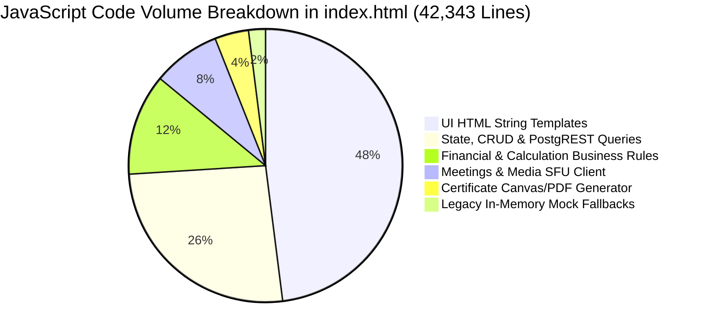

# CLASPTEK PORTAL — PHASE 1 LEGACY CODE AUDIT
## Duplicate Code, Dead Code, Generated Artifacts & Code Disposition Classification

---

### Audit Mandate & Guidelines

In strict accordance with Phase 1 instructions:
- **Zero code deletions** are performed in this phase.
- All files, functions, and backups are inventoried and classified for future migration phases.
- Categories:
  - `KEEP`: Authoritative production code or schema that must be preserved.
  - `MIGRATE`: Active functionality that will be extracted and rebuilt in Next.js / TypeScript.
  - `REFACTOR LATER`: Functional logic that requires modularization during subsequent phases.
  - `DEPRECATE`: Legacy fallbacks, redundant files, or mock structures to be safely retired after Next.js cutover.
  - `UNKNOWN`: Items requiring runtime verification before disposition.

---

## 1. File-Level Disposition Report

| File / Directory | Size | Classification | Current Role | Migration Action |
| :--- | :--- | :--- | :--- | :--- |
| `index.html` | 2.19 MB | `MIGRATE` | Monolithic application source. | Deconstruct into modular Next.js app routes, layout, and UI components. |
| `clasptek_invoice_system.html` | 2.19 MB | `DEPRECATE` | Exact mirror of `index.html`. | Retain during Phase 1–9 for backwards compatibility; retire on Next.js production cutover. |
| `public/index.html` | 2.19 MB | `DEPRECATE` | Generated deployment artifact in `public/`. | Will be replaced by Next.js `.next` compilation output. |
| `public/clasptek_invoice_system.html` | 2.19 MB | `DEPRECATE` | Generated mirror artifact. | Retire on production cutover. |
| `index.backup.html` | 962 KB | `DEPRECATE` | Pre-Phase 8 backup snapshot. | Safe to delete in Phase 10 cleanup; retained in git history. |
| `clasptek_invoice_system.backup.html` | 962 KB | `DEPRECATE` | Pre-Phase 8 backup snapshot. | Safe to delete in Phase 10 cleanup. |
| `runtime-config.js` | 249 B | `DEPRECATE` | Generated client runtime config. | Replaced by Next.js `process.env.NEXT_PUBLIC_*` environment handling. |
| `scripts/generate-runtime-config.js` | 7.8 KB | `DEPRECATE` | Pre-build config injection script. | Replaced by Next.js native build pipeline. |
| `api/admin.js` | 47 KB | `MIGRATE` | Administrative serverless functions. | Extract into Next.js App Router Route Handlers (`app/api/admin/...`). |
| `api/auth/google/*` | 21 KB | `MIGRATE` | Google OAuth serverless functions. | Extract into `app/api/auth/google/...` Route Handlers. |
| `api/meetings/*` | 35 KB | `MIGRATE` | Meeting creation, join, action, upload. | Extract into `app/api/meetings/...` Route Handlers. |
| `api/_lib/google-oauth-config.js` | 39 KB | `MIGRATE` | Server-side Google Drive library. | Move to `lib/google-drive/client.ts`. |
| `api/_lib/sfu-adapter.js` | 14 KB | `MIGRATE` | WebRTC SFU provider adapters. | Move to `lib/meetings/sfu-adapter.ts`. |
| `supabase_schema.sql` | 147 KB | `KEEP` | Authoritative PostgreSQL database DDL. | Preserved verbatim as migration ground truth. |
| `migrations/*.sql` (13 files) | ~260 KB | `KEEP` | Authoritative database migrations. | Preserved as baseline migration history. |
| `run_all_certification_suites.js` | 8 KB | `KEEP` | Master automated regression runner. | Retain as authoritative behavioral verification gate. |
| `scripts/*.js` (56 test/migration scripts) | ~780 KB | `KEEP` | Test harnesses, certification gates, probes. | Retain during migration for parity verification. |
| `scratch/` (311 files) | ~18 MB | `DEPRECATE` | Ad-hoc testing, visual PDFs, browser temp. | Gitignored; safe to purge after migration. |
| `Reference/` | 1.4 MB | `KEEP` | Reference certificate/payslip PDFs. | Retain as visual regression ground truth. |
| `assets/*.png` | ~530 KB | `KEEP` | Official logos, brand marks, certificate signature. | Migrate into Next.js `public/assets/`. |

---

## 2. In-Code Logic & Function Disposition

### 2.1 In-Memory Fallbacks & Mock Structures (`DEPRECATE`)
- **`DEFAULT_PROGRAMMES`, `DEFAULT_SYSTEM_ACCOUNTS` (lines 1,800–2,050):** Hardcoded initial fallback data used when database is unconfigured.
  - *Disposition:* **DEPRECATE** in Next.js. The app will strictly require authenticated database connectivity.
- **`memoryMeetingStore`, `memoryConnectionStore` in `api/meetings/` and `api/_lib/`:** In-memory fallback maps used in offline test runners.
  - *Disposition:* **REFACTOR LATER** to formal test mocks (`tests/mocks/sfu.ts`).

### 2.2 Historical Migration Utilities (`DEPRECATE`)
- **`inspectLegacyLocalData()`, `preserveLegacyData()` (lines 4,028–4,150):** Functions originally written to migrate data out of `localStorage` into PostgreSQL during Phase 14 cutover.
  - *Disposition:* **DEPRECATE**. Database migration is complete and PostgreSQL is authoritative.

### 2.3 UI Rendering Templates (`MIGRATE`)
- **Monolithic `render*Tab()` functions (lines 22,500–43,500):** Over 21,000 lines of string-concatenated HTML.
  - *Disposition:* **MIGRATE** into modular React functional components with TypeScript interfaces.

### 2.4 Mathematical & Financial Calculation Engines (`KEEP / MIGRATE`)
- **`invoiceBalance(inv)` (lines 12,543–12,561):**
  - Canonical formula: $\text{balance} = \max(0, \text{total} - \text{paid})$.
  - *Disposition:* **KEEP / MIGRATE** directly to TypeScript pure function (`lib/finance/calculations.ts`) with 100% unit test parity.
- **`getFinancialMetrics()` (lines 19,792–19,864):**
  - Enforces Four-Way Separation: `totalInvoiced`, `fundsReceived`, `approvedOutflows`, `netFundsMovement`.
  - *Disposition:* **KEEP / MIGRATE** directly to `lib/finance/metrics.ts`.

### 2.5 Native Vector & PDF Engine (`KEEP / MIGRATE`)
- **`generateCertificateQrSvg(url, opts)` (lines 15,477–16,260):** Pure JavaScript QR code SVG generator.
  - *Disposition:* **MIGRATE** to `lib/certificates/qr.ts` or replace with vetted lightweight library (`qrcode`).
- **`generateA4LandscapePdf(jpegBytes)` (lines 16,470–16,628):** Binary PDF generator synthesizing A4 landscape PDF document streams.
  - *Disposition:* **MIGRATE** to `lib/certificates/pdf.ts`. Preserves offline client-side export without server dependency.
