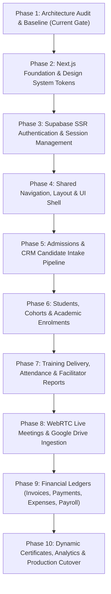

# CLASPTEK PORTAL — PHASE 1 NEXT.JS MIGRATION PLAN
## Target Architecture Proposal, Migration Readiness Matrix & Dependency Sequence

---

### Migration Mandate

- **Zero Breaking Changes:** Every business calculation, financial invariant, tenant boundary, and RLS constraint verified in Phase 1 must be preserved with 100% fidelity.
- **Incremental Rollout:** Modules are migrated according to strict topological dependency order.
- **No Premature Installation:** No Next.js packages or files are created during Phase 1.

---

## 1. Module Migration Readiness Matrix

| Business Module | Complexity | Primary Dependencies | Migration Risk | Recommended Strategy |
| :--- | :--- | :--- | :--- | :--- |
| **Authentication & Sessions** | High | GoTrue Auth, `tenant_memberships`, `profiles` | **CRITICAL** | `SERVER-SIDE REFACTOR`<br/>Implement `@supabase/ssr` with `httpOnly` secure cookie storage and Next.js middleware route protection. |
| **Design System & Layout** | Medium | CSS Custom Properties, Google Fonts, SVG Icons | **LOW** | `COMPONENT EXTRACTION`<br/>Extract `:root` tokens into CSS modules/globals and build reusable layout components (`Sidebar`, `Topbar`, `Drawer`). |
| **Admissions & Candidate CRM** | High | `crm_intake_applications`, `enquiries`, Google Forms webhook | **HIGH** | `COMPONENT EXTRACTION`<br/>Build server action for intake submission, drawer component for candidate review, and RPC client for conversion. |
| **Authoritative Students Registry** | Medium | `students`, `enrolments`, `invoices`, `payments` | **HIGH** | `DIRECT MIGRATION`<br/>Extract student profile pages, cross-referencing account balances and cohort enrollments. |
| **Programmes & Curriculum** | Medium | `programmes`, `courses`, `programme_courses` | **MEDIUM** | `DIRECT MIGRATION`<br/>Standard Server Components for read queries; client form components for course management. |
| **Cohorts & Enrolments** | Medium | `cohorts`, `enrolments`, capacity trigger | **HIGH** | `DIRECT MIGRATION`<br/>Migrate with client-side capacity warnings and server action validation. |
| **Training & Attendance** | Medium | `training_sessions`, `attendance`, `facilitator_reports` | **HIGH** | `DIRECT MIGRATION`<br/>Interactive class attendance grid with real-time optimistic UI updates. |
| **WebRTC Video Meetings** | Very High | LiveKit Cloud SFU, `getUserMedia`, `navigator.mediaDevices` | **CRITICAL** | `REQUIRES SPECIAL HANDLING`<br/>Isolate client-only WebRTC video player (`'use client'`); issue LiveKit participant tokens via Route Handlers. |
| **Google Drive Recordings** | High | Google OAuth 2.0, Drive v3 API, `google_drive_connections` | **CRITICAL** | `SERVICE EXTRACTION`<br/>Consolidate OAuth token refresh, folder verification, and multipart upload streaming into `lib/google-drive/`. |
| **Invoices & Receivables** | High | `invoices`, `invoice_items`, `payment_accounts` | **CRITICAL** | `DIRECT MIGRATION`<br/>Port `invoiceBalance()` and line item discount calculations to TypeScript with pure unit test coverage. |
| **Payments & Receipts** | High | `payments`, `execute_payment_transaction` RPC | **CRITICAL** | `SERVICE EXTRACTION`<br/>Execute all payment allocations through authoritative PostgreSQL RPC via Server Actions. |
| **Expenses & Budgets** | Medium | `expenses`, `budgets`, approval settings | **HIGH** | `DIRECT MIGRATION`<br/>Form components with multi-tier role approval logic based on amount thresholds. |
| **Payroll & Payslips** | High | `payslips`, `personnel`, employee isolation | **HIGH** | `DIRECT MIGRATION`<br/>Enforce employee self-service payslip isolation at both Next.js Server Component and RLS levels. |
| **Certificates & Verification** | High | `certificates`, SVG canvas engine, QR generator | **HIGH** | `REQUIRES SPECIAL HANDLING`<br/>Maintain client-side high-resolution 300 DPI canvas rendering for direct PDF download; build public verification page. |
| **Audit Logs & Governance** | Medium | `finance_audit_log`, `finance_periods` | **MEDIUM** | `DIRECT MIGRATION`<br/>Read-only paginated table with filter controls and period lock indicators. |

---

## 2. Proposed Target Next.js Architecture

```text
clasptek-portal/
├── app/
│   ├── layout.tsx                     # Root layout, Google Fonts, theme providers
│   ├── (auth)/                        # Authentication Route Group (Unauthenticated)
│   │   ├── layout.tsx
│   │   ├── login/page.tsx
│   │   ├── recover/page.tsx
│   │   └── reset-password/page.tsx
│   ├── (portal)/                      # Protected Enterprise Portal Route Group
│   │   ├── layout.tsx                 # Portal shell (Topbar, Sidebar, Navigation Drawer)
│   │   ├── dashboard/page.tsx         # Executive & Staff Dashboard
│   │   ├── admissions/
│   │   │   ├── page.tsx               # CRM Pipeline & Enquiries
│   │   │   └── applications/page.tsx  # Candidate Applications
│   │   ├── students/
│   │   │   ├── page.tsx               # Students Directory
│   │   │   └── [id]/page.tsx          # Student 360 Profile & Ledger
│   │   ├── curriculum/
│   │   │   ├── programmes/page.tsx    # Programmes & Courses
│   │   │   └── cohorts/page.tsx       # Intake Cohorts & Schedules
│   │   ├── training/
│   │   │   ├── attendance/page.tsx    # Class Attendance Ledger
│   │   │   └── reports/page.tsx       # Facilitator Session Reports
│   │   ├── meetings/
│   │   │   ├── page.tsx               # Meetings List & Recordings Archive
│   │   │   ├── [id]/prejoin/page.tsx  # Greenroom Device Verification
│   │   │   └── [id]/room/page.tsx     # WebRTC Live Video Classroom
│   │   ├── finance/
│   │   │   ├── invoices/page.tsx      # Invoices & Receivables
│   │   │   ├── payments/page.tsx      # Payments & Receipts
│   │   │   ├── expenses/page.tsx      # Operational Expenses & Budgets
│   │   │   └── payroll/page.tsx       # Payroll & Staff Payslips
│   │   ├── certificates/
│   │   │   ├── page.tsx               # Issued Certificates & Templates
│   │   │   └── [id]/page.tsx          # Certificate Preview & Print
│   │   ├── governance/
│   │   │   ├── controls/page.tsx      # Financial Controls & Period Locks
│   │   │   └── audit-log/page.tsx     # Immutable Audit Log
│   │   └── settings/
│   │       ├── organization/page.tsx  # Organization Profile & Accounts
│   │       ├── personnel/page.tsx     # Personnel Directory & Access Roles
│   │       └── integrations/page.tsx  # Google Drive Central Connection
│   ├── (public)/                      # Public Unauthenticated Routes
│   │   ├── apply/page.tsx             # Public Candidate Intake Application
│   │   ├── verify/[certNo]/page.tsx   # Public Certificate Verification Page
│   │   └── track/page.tsx             # Applicant Status Tracker
│   └── api/                           # Route Handlers (Edge & Node Runtime)
│       ├── admin/
│       │   ├── provision-user/route.ts
│       │   └── delete-personnel/route.ts
│       ├── intake/
│       │   └── google-forms/route.ts
│       ├── auth/
│       │   └── google/
│       │       ├── route.ts
│       │       └── callback/route.ts
│       └── meetings/
│           ├── create/route.ts
│           ├── join/route.ts
│           ├── action/route.ts
│           └── upload-recording/route.ts
├── components/
│   ├── ui/                            # Atoms: Buttons, Modals, Drawers, Badges, Tables
│   ├── layout/                        # Sidebar, Topbar, UserMenu, Breadcrumbs
│   ├── admissions/                    # CandidateDrawer, PipelineBoard, ConvertModal
│   ├── students/                      # StudentTable, StudentLedger, EnrolModal
│   ├── training/                      # AttendanceGrid, ReportForm
│   ├── meetings/                      # VideoGrid, ParticipantList, DeviceSelector, Chat
│   ├── finance/                       # InvoiceForm, LineItems, PaymentModal, PayslipView
│   └── certificates/                  # CertificateSvgDocument, QrBadge, PdfExportButton
├── lib/
│   ├── supabase/
│   │   ├── client.ts                  # Browser Supabase client (Client Components)
│   │   ├── server.ts                  # Cookie-backed Server client (Server Components)
│   │   └── admin.ts                   # Service Role client (Route Handlers only)
│   ├── auth/                          # Session helpers, role guard utilities
│   ├── finance/                       # invoiceBalance, financialMetrics calculations
│   ├── google-drive/                  # OAuth manager, folder provisioning, upload stream
│   ├── meetings/                      # LiveKit SFU token generator, adapter interfaces
│   └── certificates/                  # Vector SVG rendering, pure JS A4 PDF generator
├── types/                             # Authoritative database & domain TypeScript models
└── styles/
    └── globals.css                    # Design system tokens, typography, print styles
```

---

## 3. Dependency-Aware Migration Sequence (Phases 1 to 10)



### Phase Transition Safeguards

1. **Topological Order:** Never migrate a consumer module before its data source is certified (e.g., Invoices depends on Students; Enrolments depends on Cohorts; Meetings depends on Training Sessions).
2. **Dual-Run Parity:** During development, new Next.js routes are certified against the baseline test runner (`run_all_certification_suites.js`) using the identical PostgreSQL database.
3. **Cutover Readiness:** Production DNS switch occurs only after 100% of Phase 1 regression assertions pass on the Next.js build.
