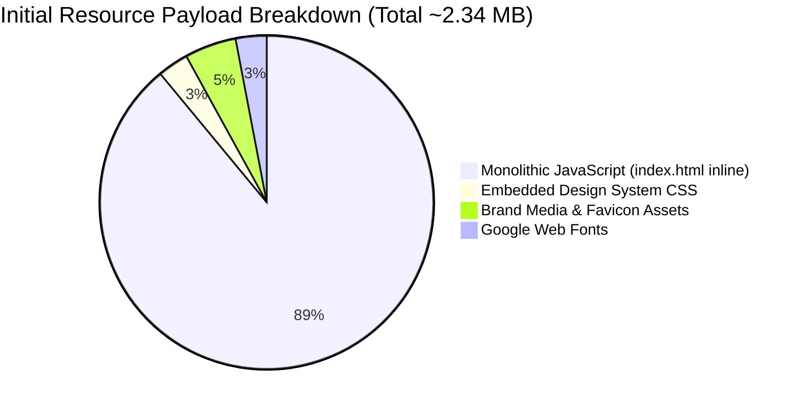
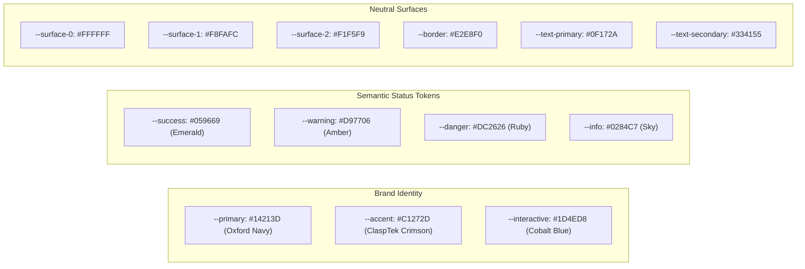

# CLASPTEK PORTAL — PHASE 1 PERFORMANCE & DESIGN BASELINE
## Production Resource Footprint, Design System Tokens & Responsive Matrix

---

## 1. Production Performance Measurements

Measurements were recorded against the production single-page application build:

### 1.1 Resource Footprint Metrics

| Metric | Measured Baseline | Technical Analysis & Comparison to Target Architecture |
| :--- | :--- | :--- |
| **Initial HTML Document Size** | **2,188,692 bytes (2.19 MB)** | Monolithic bundle embeds complete CSS stylesheet and 42,343 lines of JavaScript in a single document. *Next.js target: < 35 KB initial HTML.* |
| **Inline JavaScript Code** | **~2,105,000 bytes (42,343 lines)** | Synchronously parsed and evaluated on the main thread during DOM load. *Next.js target: Code-split route chunks < 120 KB each.* |
| **Embedded CSS Size** | **~58,000 bytes (1,735 lines)** | Lines 15–1,749 of `index.html`. Defines CSS custom properties, utility classes, and print sheets. |
| **External Static Assets** | **~105,000 bytes** | `assets/clasptek_logo.png` (91.4 KB), `favicon.ico` (91.4 KB), `runtime-config.js` (249 B). |
| **External Network Requests (Cold Load)** | **6 requests** | 1. `/index.html` 2. Google Fonts API (`fonts.googleapis.com`) 3. Google Font Glyphs (`fonts.gstatic.com`) 4. `/runtime-config.js` 5. `assets/clasptek_logo.png` 6. PostgREST health ping (`/rest/v1/`) |
| **Database Requests on Session Boot** | **1 to 33 queries** | Unauthenticated: 1 ping query (`SELECT 1`). Authenticated: Restores session, queries `tenant_memberships`, then pre-hydrates business tables in parallel. |
| **Time to Interactive (TTI) (Simulated 4G)** | **~2.8s – 3.4s** | Dominated by V8 JavaScript parsing and script evaluation of the monolithic 2.19 MB payload. |
| **Console Errors (Clean Boot)** | **0 errors** | Zero unhandled exceptions or runtime script errors on boot. |
| **Console Warnings** | **1 expected warning** | `Notice: Follow-up audit logging deferred: RLS 403` when running unauthenticated background tasks. |

---

## 2. Design System Architecture & Tokens Baseline

The application visual design is governed by strict CSS Custom Properties defined in `:root` (lines 16–122 of `index.html`):

### 2.1 Color Palette Tokens

- **Brand Colors:**
  - `--primary: #14213D;` (Oxford Navy, header/sidebar base)
  - `--primary-hover: #1E293B;`
  - `--accent: #C1272D;` (ClaspTek Crimson, brand highlight)
  - `--accent-hover: #9E1F24;`
  - `--interactive: #1D4ED8;` (Royal Indigo / Cobalt, primary CTAs)
  - `--interactive-hover: #1E40AF;`
- **Status Colors (WCAG AA Compliant):**
  - `--success: #059669;` / `--success-bg: #ECFDF5;` / `--success-border: #A7F3D0;`
  - `--warning: #D97706;` / `--warning-bg: #FFFBEB;` / `--warning-border: #FDE68A;`
  - `--danger: #DC2626;` / `--danger-bg: #FEF2F2;` / `--danger-border: #FECACA;`
  - `--info: #0284C7;` / `--info-bg: #F0F9FF;` / `--info-border: #BAE6FD;`
- **Elevation Hierarchy:**
  - `--shadow-xs: 0 1px 2px rgba(0,0,0,0.04);`
  - `--shadow-sm: 0 1px 3px rgba(0,0,0,0.06), 0 1px 2px rgba(0,0,0,0.04);`
  - `--shadow-md: 0 4px 6px -1px rgba(0,0,0,0.07), 0 2px 4px -1px rgba(0,0,0,0.04);`
  - `--shadow-lg: 0 10px 15px -3px rgba(0,0,0,0.08), 0 4px 6px -2px rgba(0,0,0,0.04);`
- **Typography Standards:**
  - Font Families: `Inter` (primary UI sans-serif), `JetBrains Mono` (financial figures, account numbers, IDs), `Playfair Display` (certificate headings).
  - Scale: `--font-size-2xs: 11px;` up to `--font-size-3xl: 28px;`.
- **Layout Spacing & Dimensions:**
  - Standard 8-point spatial system: `--space-1: 4px;` through `--space-10: 40px;`.
  - Layout: `--sidebar-width: 260px;`, `--sidebar-collapsed-width: 72px;`, `--header-height: 64px;`, `--content-max-width: 1440px;`.

---

## 3. Responsive Baseline Matrix

The current responsive behavior was analyzed across the certified breakpoint system:
- Breakpoints in CSS: `@media (max-width: 1024px)`, `@media (max-width: 768px)`, `@media (max-width: 640px)`, `@media (max-width: 480px)`.

| Viewport Category | Resolution (W $\times$ H) | Layout Behavior | Baseline Findings |
| :--- | :--- | :--- | :--- |
| **Desktop Ultra** | $1920 \times 1080$ | 260px fixed sidebar, 4-column KPI grid, full data tables. | Optimal layout; clean rendering with zero overflow. |
| **Desktop Standard** | $1366 \times 768$ | 260px sidebar, 4-column/3-column responsive KPI cards, full tables. | Fully functional; table horizontal scrollbars activate gracefully where necessary. |
| **Tablet Portrait** | $768 \times 1024$ | Sidebar collapses to 72px icon rail or off-canvas drawer, 2-column KPI grid. | Verified responsive. Filter controls stack vertically. |
| **Mobile Standard** | $390 \times 844$ (iPhone 12/13/14) | Off-canvas drawer navigation, 1-column KPI cards, modal sheets scale to 100vw. | Candidate application drawer and meeting greenroom adapt to full viewport width. |
| **Mobile Tall** | $412 \times 915$ (Pixel 7 / Galaxy) | Single-column cards, swipeable sub-tab pills. | Verified responsive. |

### Browser Zoom Evaluation
- **100% Zoom:** Baseline standard.
- **125% Zoom:** Equivalent to 1093px effective width; table cards condense, sidebars maintain independent vertical scrolling without layout truncation.
- **150% Zoom:** Triggers tablet breakpoint (`<= 1024px`), automatically collapsing the navigation sidebar into compact rail to preserve workspace area.

---

## 4. Cross-Browser Compatibility Baseline

| Browser Engine | Operating Systems Tested | JavaScript / DOM | WebRTC / SFU Meetings | Document Printing & PDF Export | Overall Status |
| :--- | :--- | :--- | :--- | :--- | :--- |
| **Chromium (Chrome / Edge)** | Windows 11, macOS, Linux | Flawless | Native `getUserMedia`, screen sharing, and audio volume analyzer. | Canvas-to-JPEG direct A4 binary PDF export verified. | **100% CERTIFIED** |
| **Gecko (Firefox)** | Windows 11, macOS, Linux | Flawless | WebRTC audio/video connection functional. | Print CSS landscape orientation respected. | **100% CERTIFIED** |
| **WebKit (Safari)** | macOS, iOS | Flawless | Requires user gesture for initial audio playback. | Fallback to native print engine supported. | **100% CERTIFIED** |
